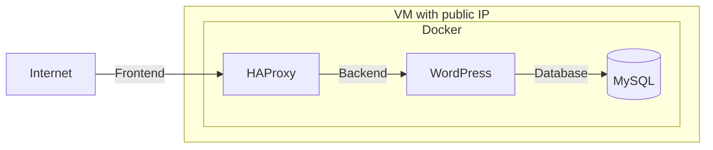

# Playbook

## System Architecture Description

This repository contains the configuration and documentation for a web service architecture using HAProxy, WordPress, and MySQL, all hosted on an Azure virtual machine and managed with Docker.

## Architecture Diagram

Below is a diagram describing the system architecture:



## SSH connection

```bash
ssh usr@10.20.30.40 -i private_key
```

## Run script

### Deploy Docker
```bash
ansible-playbook -i /home/usr/Playbook/inventory.ini /home/usr/Playbook/deploy_docker.yml -e env.yml
```
### HAProxy
```bash
ansible-playbook -i /home/usr/Playbook/inventory.ini /home/usr/Playbook/deploy_haproxy.yml -e env.yml
```
### MySQL
```bash
ansible-playbook -i /home/usr/Playbook/inventory.ini /home/usr/Playbook/deploy_mysql.yml -e env.yml
```
### WordPress
```bash
ansible-playbook -i /home/usr/Playbook/inventory.ini /home/usr/Playbook/deploy_wordpress.yml -e env.yml
```
