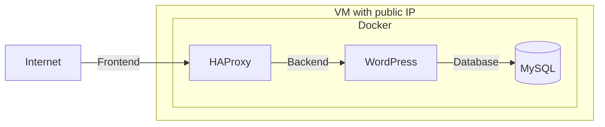

# Playbook

## Arquitectura



## Steps
1. Connects to a remote server using SSH.
2. Executes a series of commands on the remote server.
3. Retrieves the output of the executed commands.
4. Handles any errors that occur during the SSH connection or command execution.
5. Closes the SSH connection after the commands have been executed.

## SSH connection

```bash
ssh usr@10.20.30.40 -i private_key
```

## Run script

```bash
ansible-playbook -i /home/usr/Playbook/inventory.ini /home/usr/Playbook/install_docker.yml -e env.yml
```
